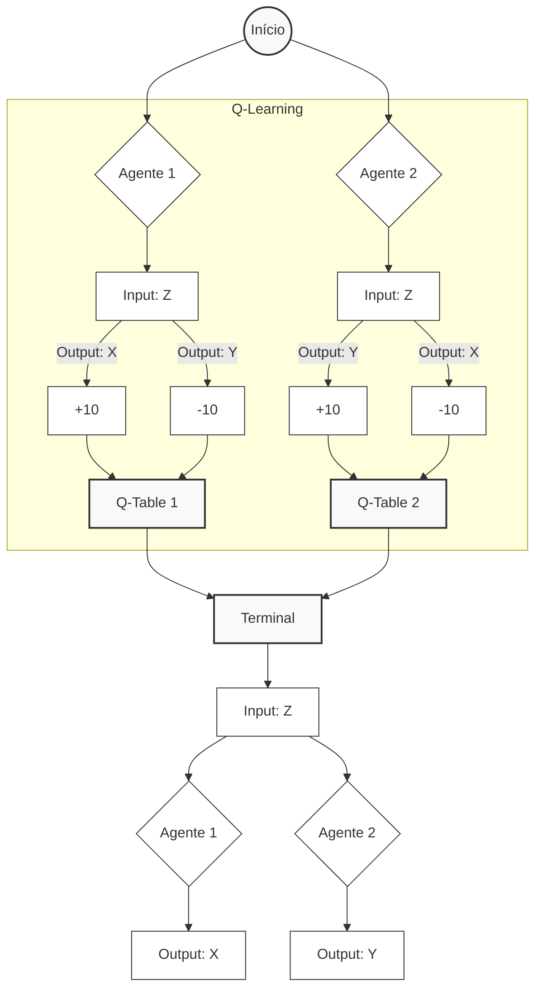

# Language Games Demonstration

## About

This project consists of demonstrating some of the main concepts created by the philosopher Ludwig Wittgenstein in his book *Philosophical Investigations (1953)*.

To demonstrate the computationally applicable nature of these concepts, two agents were created and subjected to the Q-Learning reinforcement learning algorithm, resulting in different reactions to the same inputs. This procedure will serve as a basis for demonstrating the following Wittgensteinian concepts: the primitive language of builders, language games and their multiplicity, the meaning of language as use, and language learning as training.

## Theoretical foundation

First, two agents were created, named "Builder" and "Observer." Their names were inspired by passages where Wittgenstein cites examples of primitive and restricted languages, which have different functions adapted to the context in which they are used.

The Builder was taken from this passage, where it is explicitly stated:

>§2. That philosophical concept of meaning has its place in a primitive idea of the way language functions. But one can also say that it is the idea of a language more primitive than ours.
>Let us imagine a language for which the description given by Augustine is right. The language is meant to serve for communication between a builder A and an assistant B. A is building with building-stones: there are blocks, pillars, slabs and beams. B has to pass the stones, and that in the order in which A needs them. For this purpose they use a language consisting of the words "block", "pillar", "slab", "beam". A calls them out;—B brings the stone which he has learnt to bring at such-and-such a call.——Conceive this as a complete primitive language.

The Observer, in turn, was created based on the following excerpt, which cites examples of the multiplicity of language games:

>§23. But how many kinds of sentence are there? Say assertion question, and command?—There are countless kinds: countless different kinds of use of what we call "symbols", "words", "sentences". And this multiplicity is not something fixed, given once for all; but new types of language, new language-games, as we may say, come into existence, and others become obsolete and get forgotten. (We can get a rough picture of this from the changes in mathematics.)
>Here the term "language-game" is meant to bring into prominence the fact that the speaking of language is part of an activity, or of a form of life.
>Review the multiplicity of language-games in the following examples, and in others:
>Giving orders, and obeying them—
>Describing the appearance of an object, or giving its measurements—
>Constructing an object from a description (a drawing)—
>Reporting an event—
>Speculating about an event—

This excerpt also allows us to extract the main intention of our demonstration: to train two agents to operate under two distinct language games. After training, the user can interact with the agents through the terminal, choosing the agent they want to interact with and selecting from three expressions to "speak" to the agent, representing a primitive form of language.

The Builder was trained to react to the three expressions as orders or commands, while the Observer reacts to them as data or records.

If the user says "Slab!" to the Builder, they will receive the message that the Builder has given it a slab. This happens because the Builder operates in its own language game where the expression "Slab!" means the command "Give me a slab." or something similar.

If the user says "Slab!" to the Observer, they will receive a message that the Observer has recorded their observation. This happens because the Observer also operates within its own language game, where the expression "Slab!" means "I spotted a slab; you may register the occurrence." or something similar.

In fact, we have here a clear example of how the same word has different meanings for agents; they operate under different language games, as they associate language with different actions.

>§7. [...] I will call these games "language-games" and will some-times speak of a primitive language as a language-game. [...] I shall also call the whole, consisting of language and the actions into which it is woven, the "language-game".

Let's reiterate the training the agents underwent; after all, it would be too simple to assign a sequence of conditionals to easily obtain the desired responses from the agents to the inputs.

To demonstrate Wittgenstein's idea that language learning occurs through training in its use, the agents went through the Q-Learning algorithm. During the training loop, the Builder gained points (+10) when it issued the message to "deliver the object," while the Observer gained points when it issued the message to "register (write down) the occurrence of the object." Both agents lost points (-10) whenever they issued the opposite message, that is, the message of their counterpart (for example, Builder emits the Observer's message).

>§5. [...] A child uses such primitive forms of language when it learns to talk. Here the teaching of language is not explanation, but training.
>§6. [...] The children are brought up to perform these actions, to use these words as they do so, and to react in this way to the words of others.

In conclusion, we have here not only the training described by Wittgenstein being expressed computationally, but also the meaning of words emerging through their use by agents. Meaning is the reaction (output) given a stimulus (input), a fundamental characteristic of Q-Learning.

When interacting with newly trained agents, they will offer different responses to the same input, as determined by the Q-Table. The words (inputs) will be the same, but their use (output) has changed. Therefore, their meaning has also changed.

>§6. [...] But if the ostensive teaching has this effect,—am I to say that it effects an understanding of the word? Don't you understand the call "Slab!" if you act upon it in such-and-such a way?—Doubtless the ostensive teaching helped to bring this about; but only together with a particular training. With different training the same ostensive teaching of these words would have effected a quite different understanding.

>§43. For a large class of cases—though not for all—in which we employ the word "meaning" it can be defined thus: the meaning of a word is its use in the language.

## Diagram



## Technical details

### Q-Learning

Agent learning during Q-Learning simply involves updating the values ​​in a lookup table called the Q-Table at each interaction using the Bellman Equation. The agent adjusts its previous estimate based on new experience (time difference error).

The Q-Table has rows representing States (S), columns representing Actions (A), and cells that store the Q-Value, which represents the expected future reward if the agent makes that decision in that state. Initially, the table starts from zero.

**Bellman Equation:**

* $$Q(s, a) \leftarrow Q(s, a) + \alpha \left[ r + \gamma \max_{a'} Q(s', a') - Q(s, a) \right]$$

Where:
* **$$Q_*(s, a)$$:** the current value that the agent believes the stock has.
* **$$\alpha$$:** the learning rate (how much the agent accepts new information vs. how much it retains old information).
* **$$r$$:** the immediate reward received (+10, -10).
* **$$\gamma$$:** the discount factor (how much the agent values ​​future rewards compared to immediate ones).
* **$$\max_{a'} Q(s', a')$$:** the estimate of the best possible reward in the next state ("looking to the future").

To learn, the algorithm uses the ϵ-greedy strategy:
* **Exploration:** the agent chooses a random action to discover new possibilities (with probability ϵ).
* **Exploitation:** the agent chooses the action with the highest known value Q in the table to maximize the reward (with probability 1−ϵ).

### Final Q-Tables

The Q-Tables are printed in the terminal after training. In this project, the States (S) are the words "heard" by the agent ("Slab!", "Block!", "Pillar!") and the Actions (A) are the responses by the agent ("deliver object", "write it down", "ignore").

```console
--- Builder's Q-Table ---
Word 'Slab!': [78.07627306 19.52232585 10.51825782]
Word 'Block!': [79.15075383 16.71459898 19.19453344]
Word 'Pillar!': [79.97229731 15.08639162 29.67208442]

--- Observer's Q-Table ---
Word 'Slab!': [22.58448188 77.40518445 19.81511142]
Word 'Block!': [ 7.75316181 78.29551033 28.3985238 ]
Word 'Pillar!': [10.94437546 80.56714011 19.45843349]
```

### Interaction in the terminal

Interacting with the Builder:

```console
--- Language games demonstration ---
------------------------------------

Choose who you want to talk to:

1. Builder
2. Observer
3. See Q-Table
0. Exit

Enter the option number: 1

---Talking to Builder ---
What will you say? (enter the option number)
1. Slab!
2. Block!
3. Pillar!

Option: 1

You said: 'Slab!'

>>> Reaction:

    Builder delivers you the physical object.

    (Meaning for the Builder >>> COMMAND.)

[Press Enter to return to the menu]
```

Interacting with the Observer:

```console
--- Language games demonstration ---
------------------------------------

Choose who you want to talk to:

1. Builder
2. Observer
3. See Q-Table
0. Exit

Enter the option number: 2

---Talking to Observer ---
What will you say? (enter the option number)
1. Slab!
2. Block!
3. Pillar!

Option: 3

You said: 'Pillar!'

>>> Reaction:

    Observer writes it down.

    (Meaning for the Observer >>> DATA/REGISTER.)

[Press Enter to return to the menu]
```

## License

Distributed under the MIT License. See `LICENSE.txt` for more information.

## Contact

Leonardo Santos - <leorsantos2003@gmail.com>

